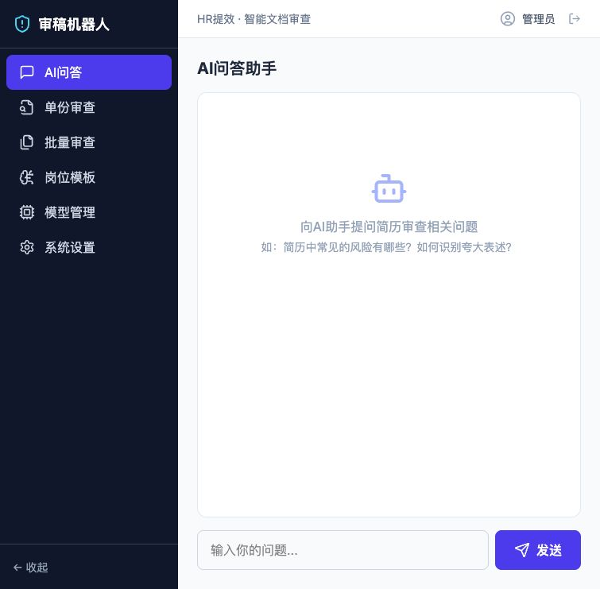
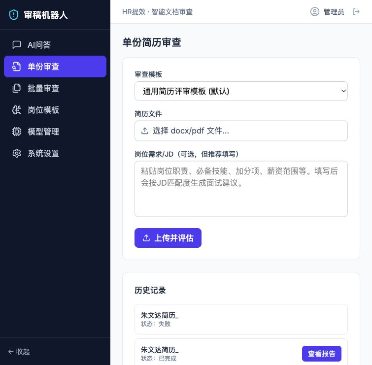
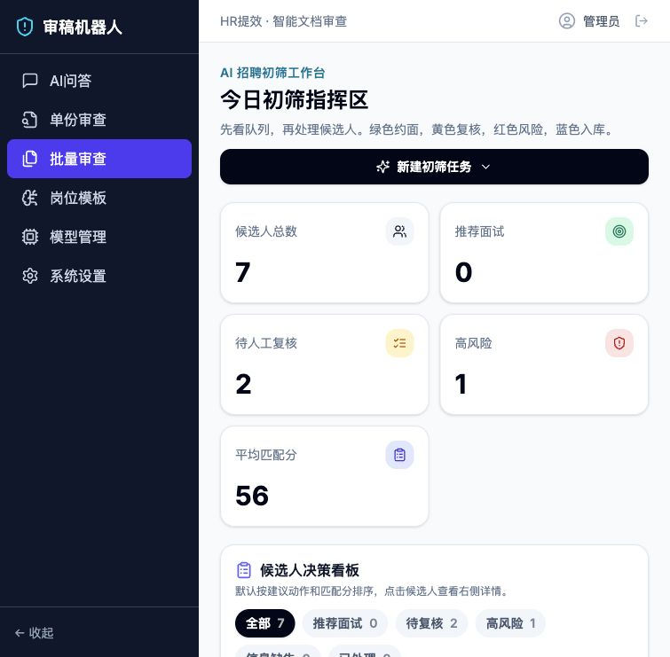
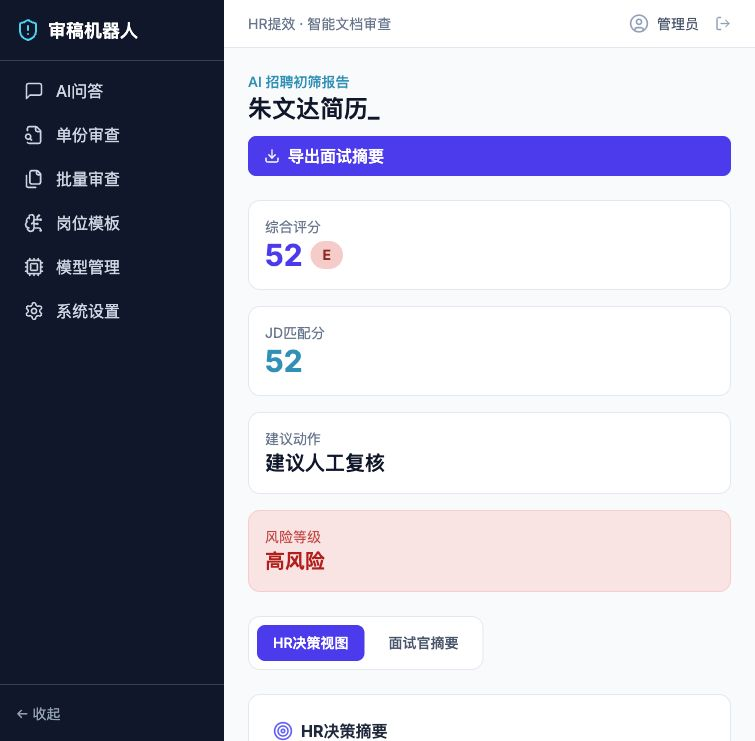
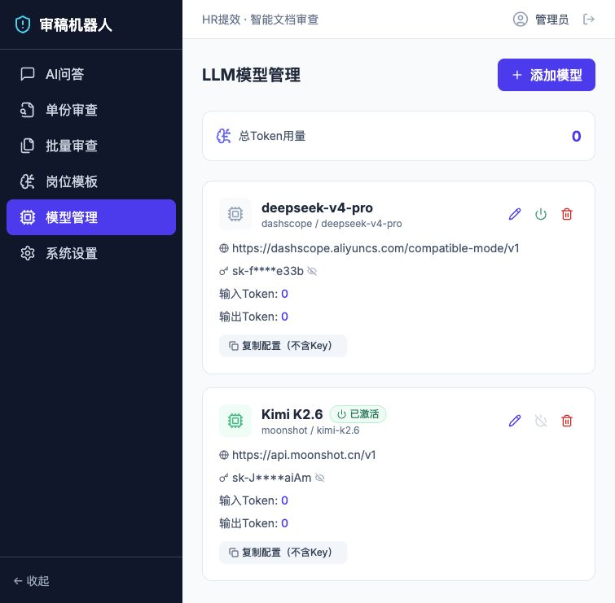

# CVizr

**CVizr = CV + viz + er**

CVizr 是一款面向中小企业 HR 的 **AI 简历初筛与候选人决策工作台**。它的目标不是简单“审简历”，而是帮助 HR 把岗位 JD、批量简历、候选人排序、风险识别、面试摘要和人才沉淀串成一条高效的招聘初筛流程。

一句话概括：**上传 JD 和简历后，CVizr 可以在几分钟内生成候选人排名、JD 匹配解释、风险证据和面试建议。**

---

## 为什么做 CVizr

传统 HR 初筛往往需要反复下载简历、逐份阅读、对照 JD、记录备注、排候选人优先级，再把候选人情况同步给业务面试官。处理一个岗位的 20 份简历，常常需要 3 到 5 小时。

CVizr 希望把这件事压缩到 10 到 20 分钟内完成：HR 只需要上传岗位 JD 和简历，系统自动完成 JD 解析、候选人评估、风险识别、排序和面试摘要生成。

它更适合这些场景：

- 中小企业 HR 需要快速处理大量简历
- 一个 HR 同时负责多个岗位，容易混淆不同 JD 下的候选人
- 业务方希望快速看到候选人的亮点、风险和面试追问
- 团队希望沉淀“暂不推进但值得保留”的人才池

---

## 提效成绩单

以一个岗位 20 份简历为例，传统初筛通常包括阅读 JD、提炼筛选标准、逐份查看简历、判断匹配度、记录风险、整理排名和写面试摘要，整体耗时通常在 3 到 5 小时。

使用 CVizr 后，HR 上传岗位 JD 和简历，系统会自动生成筛选标准、候选人排名、JD 匹配分、综合评分、风险提示和面试问题。原本大量重复阅读和整理工作，可以压缩到 10 到 20 分钟。

也就是说，一次 20 份简历的初筛任务，预计可以节省约 **85% 到 95%** 的时间。

如果每周处理 5 个岗位，每个岗位 20 份简历，传统方式可能需要 15 到 25 小时；使用 CVizr 后，这部分工作可以压缩到 1 到 2 小时左右。

---

## 核心能力

### 1. JD 驱动初筛

HR 可以上传或粘贴岗位 JD。系统会优先以 JD 作为筛选标准，而不是只按固定模板泛泛评价简历。

系统会自动生成：

- 岗位硬性要求
- 核心职责
- 加分项
- 风险关注点
- 面试追问方向

### 2. 批量候选人决策看板

批量上传简历后，系统自动评估并生成候选人排名。看板支持按照不同 JD 任务切换，避免多个岗位的候选人混在一起。

看板支持：

- JD 任务标签切换
- JD 匹配分排序
- 综合评分排序
- 推荐面试、待复核、高风险、已处理队列
- 学历、专业、毕业年份、城市、院校档次等基础筛选
- 批量导出 Excel

### 3. 双评分体系

CVizr 同时输出两套分数：

- **JD 匹配分**：候选人与当前岗位 JD 的贴合程度
- **综合评分**：候选人整体简历质量和综合潜力

HR 可以在看板中切换排序口径，既能看“谁最适合这个岗位”，也能看“谁整体实力更强”。

### 4. 候选人详情与对比

点击候选人后，可以查看居中的决策浮层，快速了解：

- 推荐理由
- JD 匹配分
- 综合评分
- 核心亮点
- 短板风险
- 硬性条件满足情况
- 面试追问建议
- HR 备注和反馈

同时支持 2 到 3 位候选人并排对比，方便 HR 快速向业务方解释为什么 A 比 B 更适合。

### 5. 风险证据链

系统不会只给出“高风险/低风险”的结论，而是尽量展示风险来源和原文证据。

重点识别：

- 时间线矛盾
- 信息缺失
- 学历/证书疑点
- 夸大表述
- AI 生成痕迹
- 薪资或到岗信息疑点

高风险候选人不会被系统直接淘汰，而是标记为“建议人工复核”。

### 6. 面试官交付包

CVizr 可以生成适合业务面试官阅读的面试摘要，并支持导出 Word 文档。

摘要内容包括：

- 候选人概览
- 核心亮点
- 主要风险
- JD 匹配证据
- 建议面试问题
- HR 备注

### 7. 人才储备库

候选人可以被加入“人才储备库”，用于沉淀暂不推进但值得长期关注的人才。

人才储备库支持：

- 查看已入库候选人
- 检索候选人
- 查看最近评估 JD
- 移出储备库
- 重新加入候选人决策
- 标记待面试

### 8. HR 反馈闭环

HR 可以对 AI 推荐结果进行反馈，例如：

- 推荐准确
- 推荐不准
- 业务通过
- 业务拒绝
- 填写详细反馈

这些反馈可用于后续沉淀企业自己的招聘偏好。

---

## 页面预览

### AI 问答助手



### 简历初筛



### 候选人决策看板



### 初筛报告



### 模型管理



---

## 技术架构

```text
hr-resume-bot/
├── backend/                 # Flask 后端服务
│   ├── ai_module/           # AI 初筛、JD 解析、风险识别、AIGC 检测
│   ├── app.py               # Flask 主应用与 API
│   ├── resume_models.py     # SQLAlchemy 数据模型
│   └── requirements.txt
├── frontend/                # React + Vite 前端
│   ├── src/pages/           # 页面组件
│   ├── src/layouts/         # 布局组件
│   ├── src/components/      # 通用组件
│   └── package.json
├── mock_resumes/            # 模拟简历和测试 JD
├── screenshots/ui/          # 产品截图
└── README.md
```

---

## 技术栈

后端：

- Flask
- SQLAlchemy
- Flask-Session
- LangChain
- Pydantic
- python-docx
- PyMuPDF
- openpyxl

前端：

- React 19
- Vite
- Tailwind CSS
- Recharts
- lucide-react

AI 模型：

- OpenAI-compatible API
- Moonshot / Kimi 模型
- 支持在模型管理页面配置和切换模型

数据库：

- SQLite：本地开发默认使用
- PostgreSQL：可扩展用于生产环境

---

## 快速启动

### 1. 配置环境变量

在项目根目录或 `backend/` 目录创建 `.env` 文件，可参考：

```env
OPENAI_API_KEY="your-api-key"
OPENAI_API_BASE="https://api.moonshot.cn/v1"
OPENAI_MODEL_NAME="kimi-k2.6"
SECRET_KEY="your-secret-key"
DATABASE_TYPE="sqlite"
```

注意：不要把真实 API Key 提交到 GitHub。

### 2. 安装后端依赖

```bash
cd backend
pip install -r requirements.txt
```

### 3. 启动后端

```bash
cd backend
python app.py
```

默认后端地址：

```text
http://127.0.0.1:5001
```

### 4. 安装前端依赖

```bash
cd frontend
npm install
```

### 5. 启动前端

```bash
cd frontend
npm run dev -- --host 127.0.0.1 --port 3000
```

默认前端地址：

```text
http://127.0.0.1:3000
```

---

## 默认账号

```text
用户名：admin
密码：admin123
```

---

## 测试素材

项目内置了一组模拟测试材料：

```text
mock_resumes/
```

其中包含：

- 20 份模拟候选人简历
- 1 份 AI 产品实习生测试 JD
- 使用说明 README

这些素材可用于快速测试批量上传、JD 匹配、候选人排序和报告生成。

---

## 安全说明

- 本项目不会在代码中硬编码真实 API Key
- 请通过 `.env` 或页面模型管理配置模型密钥
- 上传简历会保存在本地 `storage/uploads/`，该目录默认不会提交到 GitHub
- AI 评估结果仅作为辅助决策，最终面试或淘汰建议应由 HR 人工确认

---

## 后续规划

- 更细粒度的人才标签体系
- 候选人复联提醒
- 企业微信、飞书、邮箱集成
- 更完整的业务面试官协同流程
- 企业级岗位库与历史招聘偏好沉淀
- 更强的评估结果可解释性和证据链展示

---

## License

本项目目前主要用于学习、研究和产品原型展示。
